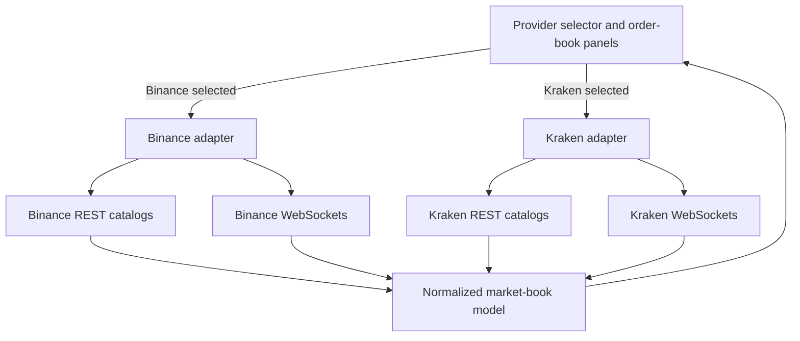

# Crypto Order Book

A real-time cryptocurrency market-monitoring dashboard for viewing multiple spot and futures order books in one place.

**Live application:** [order-book-app-gnu1.vercel.app](https://order-book-app-gnu1.vercel.app/)

## Why this project exists

This dashboard was created to solve a specific operational gap I encountered in previous work. Before it existed, I used the Binance application and opened the small bid-and-ask window for each trading pair individually just to monitor price changes. With 30 to 50 open orders across spot and futures markets, repeating that process for every pair was slow and inefficient.

The original personal tool consolidated those markets into a single screen. This repository restores and modernizes that project with clearer architecture, multiple market-data providers, regional routing, connection recovery, and portfolio-focused documentation.

The application uses public market data only. It does not connect to an exchange account, place trades, manage orders, or require API credentials.

## Features

- Live spot and futures order books with bids, asks, cumulative quantity, midpoint, last price, and spread.
- Multiple markets visible simultaneously.
- Permanent `BTCUSDT` and `ETHBTC` spot panels, with editable markets in the remaining panels.
- Compact market entry such as `XRPUSD`, `SOLUSDT`, or `ETHBTC`.
- Binance and Kraken provider selection saved in browser storage.
- Automatic Binance spot routing: Binance.US for US visitors and Binance Global elsewhere.
- Binance Global USD-M perpetual futures regardless of the selected Binance spot region.
- Region-aware default markets, including `XRPUSD` in place of suspended `XRPBTC` on Binance.US.
- Live midpoint direction feedback and per-panel data-age indicators.
- Bounded reconnection, connection timeouts, manual retry, and a user-controlled Kraken fallback.
- Clickable markets with a floating detail window containing candlesticks, market metrics, crypto news, and an AI-generated market brief.
- Responsive portfolio introduction and restoration changelog overlay.

## Technology

- Vue 3 with the Composition API and single-file components
- Vite 7
- Tailwind CSS 3
- Axios for public REST market catalogs
- Native browser WebSockets for live market data
- ESLint and Prettier
- Vitest, Vue Test Utils, and jsdom
- Vercel serverless functions for country detection, Marketaux crypto news, and Gemini market insights

No state-management library, backend database, authentication system, or exchange API key is required.

## Architecture



Provider-specific payloads do not flow directly into the display components. Each adapter translates its exchange data into the shared model in `src/services/marketData/marketBook.js`. The UI therefore renders one consistent structure regardless of which provider is selected.

### Important files

| Path | Responsibility |
| --- | --- |
| `src/App.vue` | Application header, project overlay state, and dashboard shell |
| `src/components/ProjectOverlay.vue` | Portfolio introduction and user-facing restoration history |
| `src/components/OrderBook.vue` | Provider selection and persistence |
| `src/components/ProviderOrderBooks.vue` | Spot/futures sections, provider errors, retry, and fallback controls |
| `src/components/OrderBookPanel.vue` | Individual market display and inline market editing |
| `src/components/MarketDetailsModal.vue` | Floating candle chart, market metrics, news, and AI brief |
| `src/services/marketDetails.js` | Historical candles, market-detail metrics, news, and insight requests |
| `src/composables/useBinanceOrderBooks.js` | Binance sockets, subscriptions, reconnection, and symbol changes |
| `src/composables/useKrakenOrderBooks.js` | Kraken sockets, subscriptions, reconnection, and symbol changes |
| `src/services/marketData/marketBook.js` | Provider-neutral market-book normalization and calculations |
| `src/services/binanceMarkets.js` | Binance endpoints, regional defaults, catalogs, and symbol resolution |
| `src/services/krakenMarkets.js` | Kraken endpoints, catalogs, aliases, and symbol resolution |
| `api/region.js` | Vercel country-header endpoint used for Binance spot routing |
| `api/market-news.js` | Server-side Marketaux news proxy |
| `api/market-insights.js` | Server-side Gemini market briefs |
| `CHANGELOG.md` | Detailed, newest-first restoration record |

## Market-data flow

1. The visitor chooses Binance or Kraken. Binance is the default unless a previous choice exists in browser storage.
2. The selected provider adapter loads its current spot and futures market catalogs through public REST endpoints.
3. If a catalog is temporarily unavailable, the adapter uses a small built-in catalog for the dashboard defaults.
4. One spot WebSocket and one futures WebSocket are opened for that visitor.
5. The adapter translates exchange-specific messages into the normalized market-book model.
6. Vue reacts to the normalized data and updates the panels, midpoint, spread, price direction, and update age.
7. Changing a Binance market updates live subscriptions without reconnecting the whole socket. Kraken currently resubscribes through a controlled socket reconnect because its subscription format differs.
8. Switching providers unmounts the active feed and closes its sockets before starting the selected provider.

## Provider behavior

### Binance

- Default provider.
- US deployment visitors use Binance.US spot REST and WebSocket endpoints.
- Other deployment visitors use Binance Global spot endpoints.
- Futures always use Binance Global USD-M perpetual market data.
- Spot partial-depth streams request updates at 100 ms intervals when the exchange publishes changes.

### Kraken

- Available as a manual provider choice and as an offered alternative when Binance cannot connect.
- Uses Kraken WebSocket v2 for spot markets.
- Uses Kraken Futures WebSocket feeds for perpetual futures markets.
- Kraken futures panels use USD-quoted symbols such as `BTCUSD` rather than Binance-style `BTCUSDT`.

Provider selection never changes silently. A visitor must explicitly choose the alternative provider.

## Regional routing

The Vercel function at `api/region.js` reads the platform-provided `x-vercel-ip-country` request header and returns only the two-letter country code. No third-party geolocation service, API key, or precise location is used.

- Country `US` routes Binance spot data to Binance.US.
- Other recognized countries route Binance spot data to Binance Global.
- Local Vite development defaults to Binance.US because Vercel geolocation headers are not available locally.
- Binance futures remain on Binance Global as an intentional product decision.

Regional routing improves compatibility but cannot guarantee that every provider endpoint is available on every network.

## Local development

### Requirements

- Node.js compatible with Vite 7
- npm
- An internet connection for public REST and WebSocket market data

### Setup

```bash
git clone <repository-url>
cd order-book-app
npm install
npm run dev
```

Open the local address printed by Vite, normally `http://localhost:5173`.

### Available commands

```bash
npm run dev      # Start the Vite development server
npm run build    # Create a production build
npm run preview  # Preview the production build locally
npm test         # Run the automated test suite once
npm run test:watch # Run tests continuously during development
npm run lint     # Run ESLint with automatic fixes
npm run lint:check # Run ESLint without modifying files
npm run format   # Format source files with Prettier
```

### Optional market news and AI brief

Copy `.env.example` to `.env.local`, then add your server-side Marketaux and Gemini keys:

```dotenv
MARKETAUX_API_KEY=your_marketaux_key
GEMINI_API_KEY=your_gemini_key
GEMINI_MODEL=gemini-3.8-flash
```

These values are used only by the local API middleware and serverless functions; do not expose them with Vite's `VITE_` prefix or commit `.env.local`.

The brief uses only Gemini (GEMINI_MODEL defaults to gemini-3.8-flash). Gemini 3 models use low thinking effort with room for reasoning and the final structured response. Temporary service errors, rate limits, network errors, and timeouts are retried once with jitter and any provider retry delay, within a 55-second request budget. Each attempt is capped at 25 seconds; the browser waits up to 60 seconds. Long retry delays are returned instead of retried early. Configuration failures and invalid output are not automatically retried. The interface distinguishes busy service, quota, timeout, configuration, and incomplete-response errors. Google availability and quotas still apply.

## Testing

The deterministic test suite does not connect to live exchange APIs or WebSockets. It currently covers:

- Normalized snapshots, incremental updates, cumulative totals, midpoint, spread, and price direction.
- Binance regional defaults, endpoint selection, and symbol resolution.
- Kraken compact-symbol and BTC/XBT alias resolution.
- Editable and fixed market behavior.
- Compact symbol entry and update-age display.
- Default provider selection, manual switching, and browser persistence.

Run the suite with `npm test`.

## Continuous integration

The GitHub Actions workflow in `.github/workflows/ci.yml` runs for pushes and pull requests targeting `main`. It uses Node.js 22 and the committed npm lockfile to:

1. Install dependencies with `npm ci`.
2. Run the automated test suite.
3. Run ESLint without modifying files.
4. Create a production build.
5. Audit production dependencies.

## Deployment

The application is designed for Vercel:

1. Import the repository into Vercel.
2. Use the Vite framework preset.
3. Use `npm run build` as the build command.
4. Use `dist` as the output directory.
5. Add `MARKETAUX_API_KEY`, `GEMINI_API_KEY`, and `GEMINI_MODEL=gemini-3.8-flash` as Vercel environment variables if the optional news and AI brief should be enabled.

After deployment, verify that `/api/region` returns the expected country code and that the interface labels the selected Binance spot venue correctly.

The current production deployment is available at [order-book-app-gnu1.vercel.app](https://order-book-app-gnu1.vercel.app/). Its Vite application, production assets, and `/api/region` function were verified after deployment on September 21, 2026.

## Reliability behavior

- REST catalog requests time out and fall back to built-in default markets.
- WebSocket connection attempts time out after ten seconds.
- Automatic reconnection stops after three consecutive failures.
- Provider-level failures show a clear retry action.
- Binance failures offer a manual switch to Kraken.
- Invalid or unavailable symbols are reported at the affected panel without replacing the working market.
- Provider switches and component unmounting close obsolete WebSocket connections.

## Current limitations

- Binance Global endpoints may be restricted in some regions or networks.
- Binance Global futures availability depends on the visitor's network even when Binance.US spot is selected.
- Update frequency reflects real exchange activity; quieter markets may move less often.
- The market layout and selected editable symbols are not yet persisted between sessions.
- Marketaux and Gemini are third-party services with independent quotas and availability. The AI brief may be temporarily unavailable when the free endpoint is rate-limited or at capacity.

## Roadmap

- Expand automated coverage to WebSocket connection state transitions and recovery behavior.
- Complete responsive, keyboard, and screen-reader testing.
- Perform production verification of Vercel regional routing and provider behavior.

## Restoration history

This repository is an incremental restoration rather than a ground-up rewrite. The detailed record is maintained in [CHANGELOG.md](CHANGELOG.md), with the newest work listed first.
